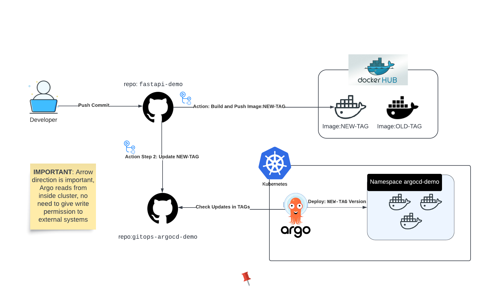

# GitOps using ArgoCD 

This is the `gitops` repo companion for the main repository [`https://github.com/efraintorlo/fastapi-demo`](https://github.com/efraintorlo/fastapi-demo). Here we store K8s manifests and other resources that are used to deploy the main repo. 

We use [kustomize](https://kustomize.io/) to adapt and generate the manifests that are consumed by ArgoCD.

## GitOps Workflow

The workflow is the following:

1. We make changes to the main repo.
2. We build and push the image to the container registry.
3. Push TAG to the `gitops` repo.
4. ArgoCD detects the changes and deploys the new version of the application.

Diagram of the workflow:



## How to configure

We assume that you have a Kubernetes cluster and ArgoCD installed. Also you need to have `kubectl` and `kustomize` installed.

### 1. Create a namespace

```bash
kubectl create namespace fastapi-demo
```

### 2. Create ArgoCD application

